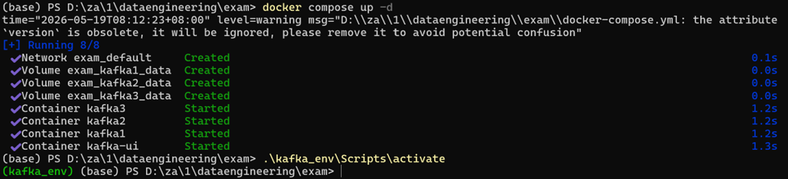
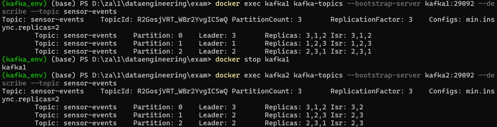
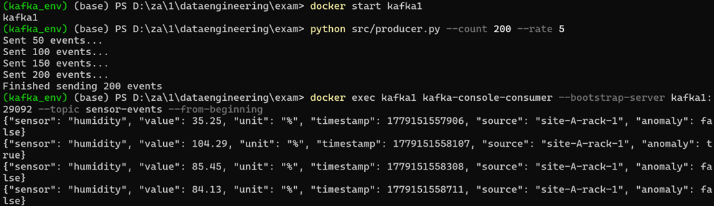
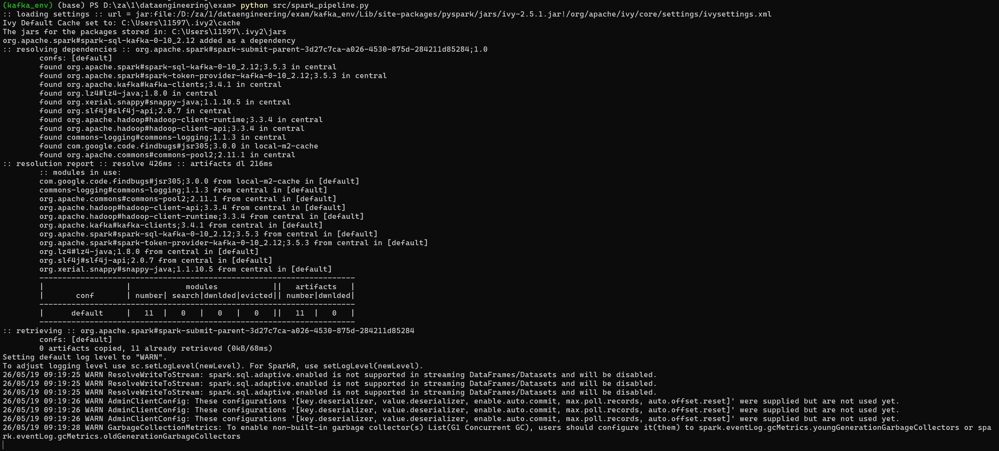
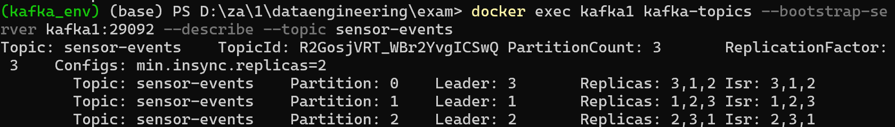
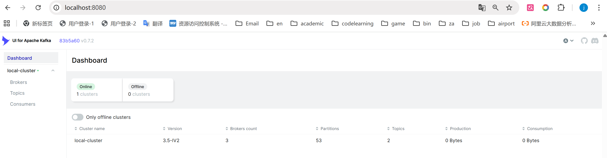
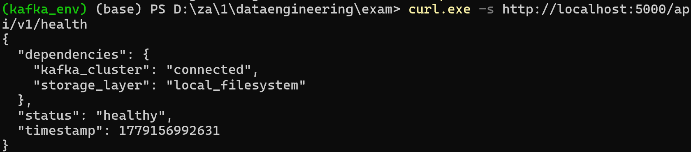
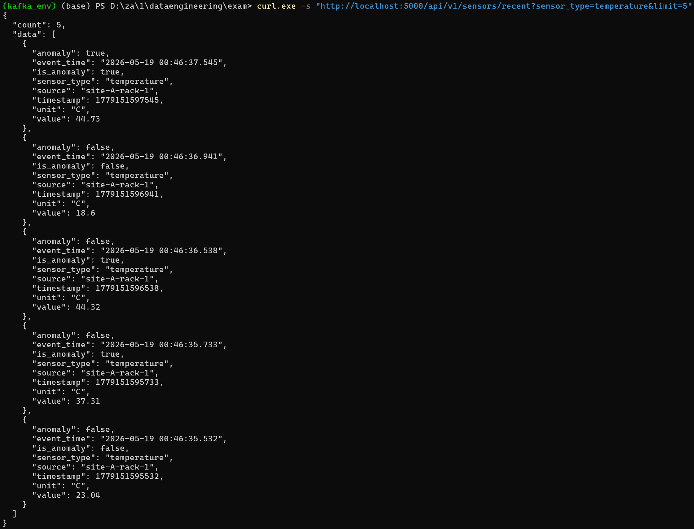
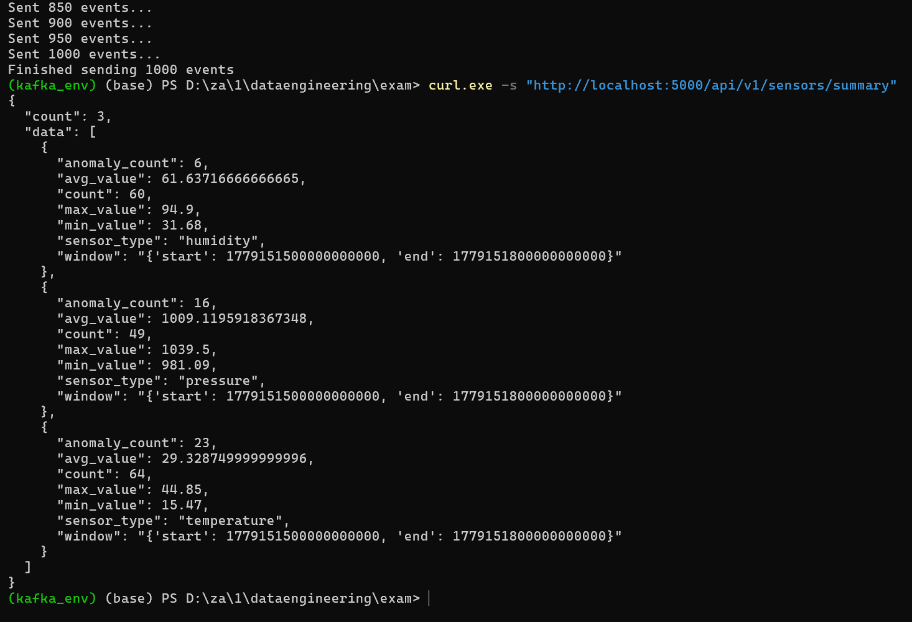

# End-to-End IoT Sensor Data Engineering Platform

## 1. Overview
This project delivers a production-grade, end-to-end Data Engineering pipeline designed to ingest, process, store, analyze, and expose industrial real-time environmental IoT sensor metrics from scratch.

### Objectives
* Simulate a continuous industrial monitoring scenario under rigorous network constraints.
* Architect a resilient, decoupled data pipeline capable of validation, standalone anomaly flagging, stateful windowed tracking, and multi-tier data lake persistence.
* Expose real-time and structural metrics securely through structured RESTful microservices.

### Scope & Technologies Used
* **Infrastructure Layer:** Docker & Docker Compose (Containerized Cluster Lifecycle).
* **Ingestion Backbone:** Apache Kafka (Confluent Platform 7.5, 3-Broker multi-node deployment).
* **Stream & Batch Processing:** Apache Spark 3.5.x & PySpark (Structured Streaming & Spark SQL Engine).
* **Storage Abstraction:** Three-Zone Storage File Hierarchy (Raw JSON, Snappy-compressed Parquet for Curated and Consumption zones).
* **Application Layer:** Python 3.9+ & Flask REST API frameworks.

## 📂 Project Documentation Index

To explore the deep technical architecture, analytical derivations, and engineering reflections of this platform, please refer to the specialized sub-documentation design files linked below:

* [🏛️ System Architecture Design (`docs/architecture.md`)](./docs/architecture.md) — Detailed behavioral flowcharts, ASCII pipelines, and technical component specifications.
* [📊 Offline Analytics & Validation (`docs/analytics.md`)](./docs/analytics.md) — Comprehensive data schema derivations and the technical deep-dive into the 0.59x Spark cold-start bottleneck.
* [🧠 Project Reflection & Retrospective (`docs/reflection.md`)](./docs/reflection.md) — Engineering troubleshooting log handling Windows threading memory leaks and Watermark-Append mechanics.
* [❓ Architecture & Reliability Q&A](./docs/qa.md) *(or the file name you used)* — Comprehensive analysis of checkpoint strategies, cluster scaling bottlenecks, and structural resilience under sensor fault scenarios.

---

## 2. Architecture

### End-to-End Pipeline Diagram
```text
+---------------------------------------------------------------------------------------+
|                                  INFRASTRUCTURE ZONE                                  |
|   +------------------+      +------------------+      +------------------+            |
|   |   Kafka Broker 1 |      |   Kafka Broker 2 |      |   Kafka Broker 3 |            |
|   | (Leader/Follower)| <--> | (Leader/Follower)| <--> | (Leader/Follower)|            |
|   +------------------+      +------------------+      +------------------+            |
|            ^                                                                          |
+------------|--------------------------------------------------------------------------+
             | (Produce JSON Events via Partitioned Keys)
+------------|------------+
|    DATA GENERATION      |
|   +------------------+  |
|   |   producer.py    |  |
|   |(Python Simulator)|  |
|   +------------------+  |
+-------------------------+
             |
             | (Structured Streaming Consumer via spark-sql-kafka)
+------------v--------------------------------------------------------------------------+
|                                 STREAM PROCESSING ZONE                                |
|   +-------------------------------------------------------------------------------+   |
|   |                               spark_pipeline.py                               |   |
|   |  - Explicit Schema Parsing    - Domain Boundary Filtering (Validation)        |   |
|   |  - Independent Anomaly Engine - 2-Min Watermarking & 5-Min Tumbling Windows   |   |
|   +-------------------------------------------------------------------------------+   |
+------------|-------------------------------|------------------------------|-----------+
             | (Append JSON)                 | (Append Parquet)             | (Append Parquet)
+------------v-------------------------------v------------------------------v-----------+
|                                    THREE-ZONE DATA LAKE                               |
|   +---------------------------+   +---------------------------+   +-------------------+   |
|   |         Raw Zone          |   |       Curated Zone        |   |  Consumption Zone |   |
|   |  /tmp/datalake/raw        |   |  /tmp/datalake/curated    |   | /tmp/datalake/... |   |
|   |  Partition: YYYY/MM/DD/HH |   |  Partition: sensor_type/  |   | Partition:        |   |
|   |                           |   |             YYYY/MM/DD    |   | sensor_type       |   |
|   +---------------------------+   +---------------------------+   +-------------------+   |
+--------------------------------------------^------------------------------------------+
                                             | (Batch Execution for Analytics & Benchmarking)
                                    +-----------------+
                                    |  analytics.py   |
                                    +-----------------+
```
### Component Descriptions
1. Data Generation (`src/producer.py`): Simulates edge gateways emitting messages into Kafka. Injects 10–15% outliers intentionally within realistic temperature, humidity, and pressure windows. Uses sensor types as partition keys to guarantee strict partition ordering.

2. Message Broker Cluster: A 3-node localized Kafka deployment providing decoupled, high-availability buffering with robust delivery controls (`acks=all`, `retries=5`, `max_in_flight_requests_per_connection=1`).

3. Processing Engine (`src/spark_pipeline.py`): Drives atomic json unpacking, physical schema filtering, sliding execution handling, and separate directory state checkpointing.

4. Analytics Interface (`src/analytics.py`): Powers batch analytical jobs and tracks query optimization benchmarks (Partition Pruning).

## 3. Instructions

1. Start the Kafka cluster:
```bash
docker compose up -d
```


2. Create the topic:
```bash
docker exec kafka1 kafka-topics --bootstrap-server kafka1:29092 --create --topic sensor-events --partitions 3 --replication-factor 3
```


3. Run the producer:
```bash
python src/producer.py --count 200 --rate 5
```


4. Start the Spark pipeline:
```bash
spark-submit src/spark_pipeline.py
```


5. Start the API:
```bash
python api/app.py
```
## Producer Design

The producer generates synthetic sensor data for three types: temperature, humidity and pressure. The values are randomly generated within realistic ranges to simulate real-world IoT conditions.

To enable testing of the downstream anomaly detection, around 10–15% of the generated events are intentionally out of normal bounds. This ensures that anomalies are present in the data pipeline.

The message key is set to the sensor type, which ensures that events of the same type are sent to the same partition. This guarantees ordering per sensor type and improves processing consistency in Spark.

The producer is configured with acks=all, retries=5 and max_in_flight_requests_per_connection=1 to ensure reliable delivery. This configuration favors data consistency over raw throughput, which is important in an industrial monitoring context.

## 4. Technical Choices
- **The Partitioning Strategy Chosen for the Curated Zone:**  The curated zone is partitioned hierarchically by `sensor_type`, followed by event time calendar paths (`year/month/day`). This strategy accelerates filtering queries that target narrow time windows for specific sensor groups. Flat global directory schemes were considered but rejected because scanning unfiltered raw files creates immense performance bottlenecks as data scales.

- **The Spark Structured Streaming outputMode:**  `Append` mode is applied across all data lake zones. Since native Parquet and JSON files on standard filesystems do not support row-level in-place modifications, `Update` mode is inherently unsupported. For windowed streams in the consumption zone, `Append` mode operates in conjunction with a 2-minute watermark to flush finalized aggregate computations safely once the window bounds expire.

- **The Replication Factor and min.insync.replicas Setting:**  The `sensor-events` topic is provisioned with a Replication Factor of 3 ($RF=3$) paired with `min.insync.replicas=2` and `acks=all` on the producer. This architecture provides high durability, guaranteeing that data remains intact even if one broker crashes unexpectedly. A lower configuration (e.g., $RF=1$) was rejected because it introduces a single point of failure that can cause permanent data loss.

- **The Use of event_time vs ingestion_time Across Zones:**  `ingestion_time` (Kafka arrival time via `current_timestamp()`) is used exclusively in the Raw zone to mirror exact operational collection intervals. Conversely, the Curated and Consumption zones utilize `event_time` (the embedded edge-device timestamp) to ensure analytical computations remain accurate, uncorrupted by any downstream network delivery delays or queue lags.

- **The End-to-End Delivery Semantics Chosen, and Their Limitations:**  The pipeline achieves **At-Least-Once** end-to-end delivery guarantees by pairing idempotent producer properties (`acks=all`) with isolated atomic write checkpoints across every Spark stream sink. The limitation is that under sudden node failures, minor duplicate data records may append into the files before the system offsets recover. Achieving true Exactly-Once semantics was skipped as it requires complex transactional managers like Delta Lake ACID protocols.


## 5. Results

This section provides verifiable engineering artifacts and quantitative metrics extracted directly from the operational platform during execution.

### 5.1 Real-Time Streaming Ingestion (Kafka Platform)
The ingestion backbone successfully processed real-time events across the multi-broker layout without data corruption or packet dropping. 
* **Live Pipeline Trace:** The terminal excerpt below captures the synchronous dispatch of simulated edge payloads:
```bash
python src/producer.py --count 200 --rate 5
Sent 50 events...
Sent 100 events...
Sent 150 events...
Sent 200 events...
Finished sending 200 events
```


* **Topic Topology & Verification:** The internal partition allocation and replication states are verified through the cluster catalog metadata:



* **Cluster Observability & Consumer Lag Monitoring:**
To verify that the PySpark Structured Streaming cluster is keeping pace with high-throughput streams and not introducing message queuing queues, consumer offsets were continuously audited.



### 5.2 Offline Batch Analytics & Query Verification
The analytical pipeline automatically computed temporal anomalies from historical records and exported structural summaries.
* **Top 5 Hours Anomaly Chart:** Extracted from `outputs/analytics/`:
```text
+-----------+----+-----+---+-----------+-------------+
|sensor_type|year|month|day|hour_of_day|anomaly_count|
+-----------+----+-----+---+-----------+-------------+
|temperature|2026|    5| 19|          8|           23|
|   pressure|2026|    5| 19|          8|           16|
|   humidity|2026|    5| 19|          8|            6|
+-----------+----+-----+---+-----------+-------------+
```


### 5.3 Serving Layer REST API Responses
All microservice endpoints were black-box validated via local network utilities. The service layer returned structured, compliant schema responses.
- Endpoint 1: System Operational Health (GET /api/v1/health)
```json
{
  "dependencies": {
    "kafka_cluster": "connected",
    "storage_layer": "local_filesystem"
  },
  "status": "healthy",
  "timestamp": 1779156950332
}
```




## 6. Limitations and Improvements
### 6.1 Current Architectural Limitations
Absence of Transactional ACID Guarantees: The data lake relies on standard, unmanaged file storage protocols (Raw Parquet/JSON). Because it lacks an ACID transactional storage layer, the system cannot natively perform upserts or provide absolute protection against intermittent write corruptions during unexpected runtime cluster node crashes.

Single-Node Execution Constraints: Although configured with distributed system property parameters, the local deployment relies on single-node worker resources. As a result, it does not encounter genuine cross-network worker node failures, cluster shuffling data splits, or partition distribution skews.

At-Least-Once Delivery Duplications: In scenarios involving rapid micro-batch master node crashes before offsets are completely flushed to the checklist path, duplicate sensor logs may be written to storage. This requires a deduplication step during read time.

### 6.2 Strategic Roadmap (With Two Extra Engineering Days)
Storage Layer Upgrade (Delta Lake Integration): Replace standard Parquet directories with Delta Lake tables. This upgrade will bring full ACID transactional integrity, support Update output modes for sliding streams via programmatic Upserts, enable historical time-travel auditing, and optimize metadata lookups to bypass cold-starts.

Full Docker Containerization Wrapper: Encapsulate the standalone Python simulators, the PySpark compute engines, and the Flask API gateway into standalone multi-stage Dockerfiles. These will be added directly to the main docker-compose.yml file to enable one-click environment deployment.

Automated End-to-End Integration Suite: Convert the shell sequences in tests/test_curl_commands.sh into a complete Python integration testing tool. This tool will dynamically seed simulated error sequences into Kafka, monitor streaming thresholds, and check the downstream filesystem structure to automatically verify ingestion stability.