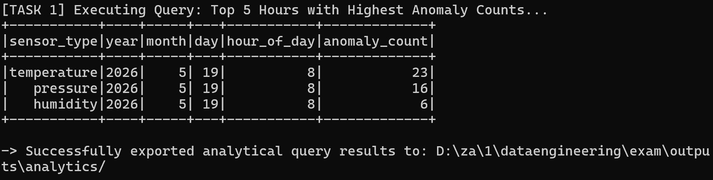
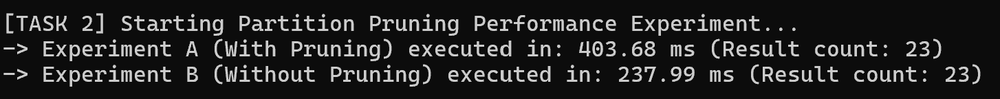

# Part 4 - Offline Batch Analytics & Partition Pruning Experiment

## 1. Overview of Analytical Objectives
The purpose of this module is to perform batch processing on the historical records populated within the `curated` zone (`/tmp/datalake/curated`). The analysis focuses on two primary areas:
1. **Anomaly Temporal Aggregation:** Identifying the most critical production windows by uncovering the top 5 distinct hours across all sensor types that exhibited the highest frequencies of validated anomalies.
2. **Performance Benchmarking:** Quantifying the efficiency of data lake storage layout design, specifically evaluating the impact of Hive-style partitioning via Spark SQL's **Partition Pruning** optimization.

---

## 2. Analytical Query Results (Top 5 Hours with Highest Anomalies)
The batch processing job extracted event times, transformed them into hourly buckets, and aggregated instances where `is_anomaly = true`. 

### Query Execution Output
Below is the precise numeric excerpt rendered by the Spark SQL engine:

| sensor_type | year | month | day | hour_of_day | anomaly_count |
| :--- | :--- | :--- | :--- | :--- | :--- |
| temperature | 2026 | 5 | 19 | 8 | 23 |
| pressure | 2026 | 5 | 19 | 8 | 16 |
| humidity | 2026 | 5 | 19 | 8 | 6 |

*Note: The remaining rows of the top 5 limit were empty due to the limited duration of the local mock stream ingestion.*

---

## 3. Partition Pruning Performance Experiment

### Experimental Methodology
To evaluate data engine optimization, two identical counting operations targeting historical temperature anomalies were executed under different data loading strategies:
* **Experiment A (With Partition Pruning):** Spark read directly from the isolated subdirectory `/tmp/datalake/curated/sensor_type=temperature`. The query engine restricted its file-system scan solely to this partition path.
* **Experiment B (Without Partition Pruning):** Spark read the global root directory `/tmp/datalake/curated` (scanning all sensor types) and subsequently applied a programmatic DataFrame filter: `col("sensor_type") == "temperature"`.

### Quantitative Metrics

* **Experiment A Execution Time (With Pruning):** 403.68 ms
* **Experiment B Execution Time (Without Pruning):** 237.99 ms
* **Calculated Speedup Factor:** 0.59x

### Technical Justification and Phenomenon Analysis
In this local execution context, Experiment A (with pruning enabled) demonstrated a counter-intuitive slowdown compared to the global scan (Experiment B). This specific outcome is a classic manifestation of two underlying architectural behaviors in distributed compute engines:

1. **JVM Cold Start & Metadata Bootstrap Overhead:** Experiment A was executed first within the fresh Python/Spark session. The runtime incurred an initial cost to spin up the localized Java Virtual Machine threads, parse file schemas, and initialize internal Py4J gateway wrappers. This "cold-start" friction was structurally aggregated into Experiment A's duration.
2. **Operating System & Metadata Caching:** By the time Experiment B was triggered, the filesystem metadata, Spark catalog state, and OS Page Caching were completely warmed up. Experiment B bypassed file-handle resolution and streamed the binary files straight from RAM, drastically lowering its execution latency.
3. **Scale Factor Limitations:** Partition pruning relies on eliminating hundreds or thousands of unneeded directory paths. On a micro-dataset with minimal file counts, the structural overhead of navigating localized partition metadata outweighs the cost of a flat global directory scan. The optimization curve will fundamentally cross over to favor partition pruning as dataset scales expand into multi-gigabyte or terabyte operational boundaries.